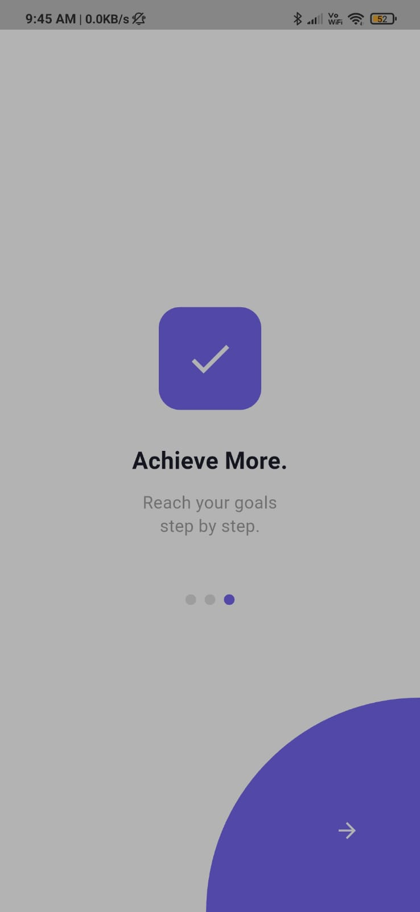
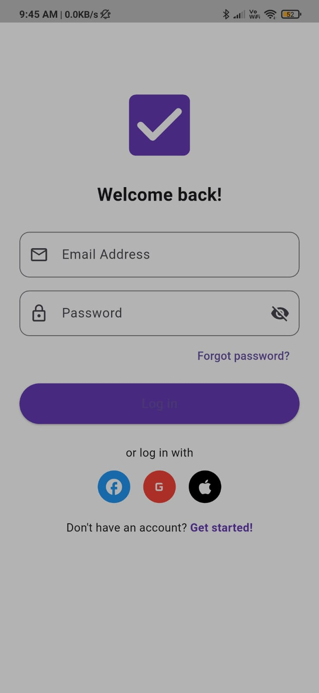
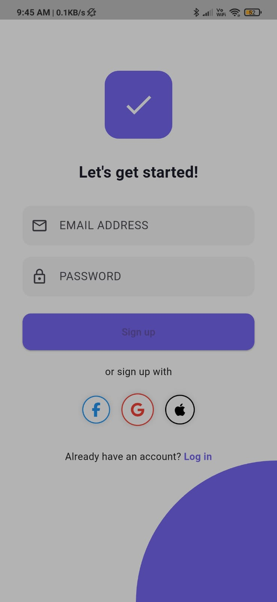
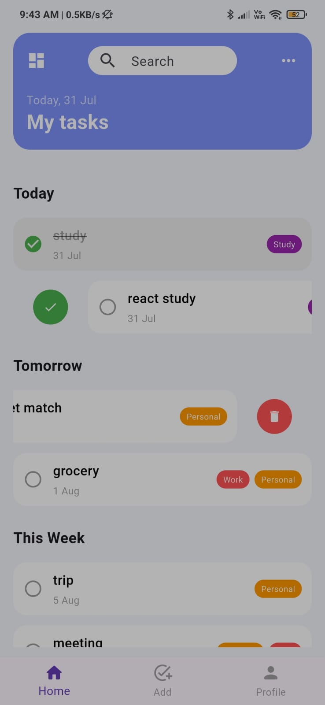
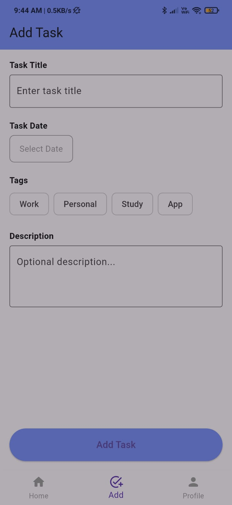
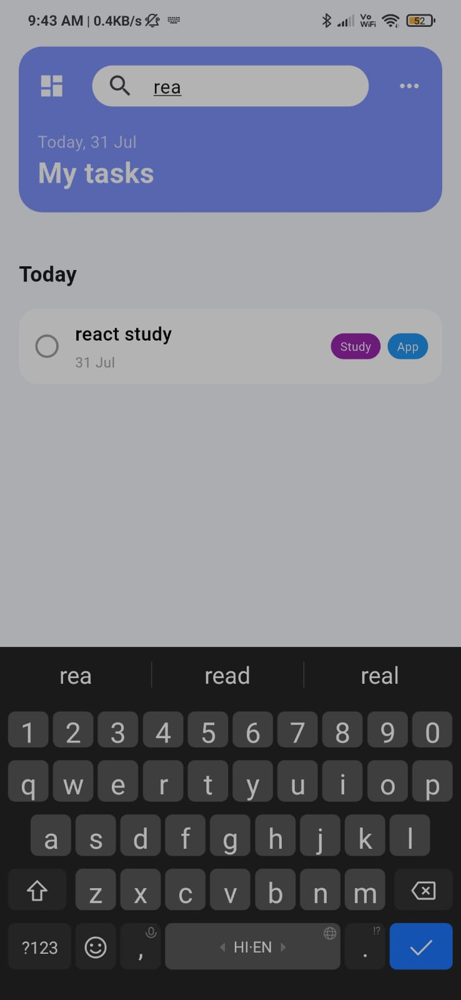
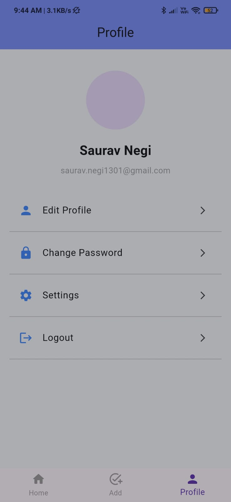

# 📋 GigTaskManager App

A Flutter-based task management mobile application that helps users manage their daily gigs and tasks efficiently. It provides seamless task categorization, real-time updates, swipe actions, and an elegant UI for enhanced productivity.

---

## 🚀 Features

- ✨ Beautiful Onboarding Flow.
- 🔐 Firebase Authentication (Login & Signup).
- 🗂️ Categorized Tasks (Today, Tomorrow, This Week).
- 📆 Real-Time Date Display on Home Screen.
- 🔍 Search Functionality for Filtering Tasks.
- 👈 Swipe Actions (Mark as Done & Delete Tasks).
- ➕ Add Task Screen (Title, Date, Tags).
- 👤 Profile Screen (For future enhancements).
- ☁️ Firebase Firestore Integration for Real-time Data Sync.

---

## 🏗️ Tech Stack

- **Flutter** (UI & State Management)
- **Firebase Authentication** (User Login/Signup)
- **Firebase Firestore** (Cloud Database)
- **Flutter Slidable** (Swipe gestures)
- **Intl Package** (Date Formatting)

---

## 📂 Project Structure

```
lib/
├── components/
│   └── task_card.dart
├── screens/
│   ├── onboarding_screen.dart
│   ├── login_screen.dart
│   ├── signup_screen.dart
│   ├── home_screen.dart
│   ├── add_task_screen.dart
│   └── profile_screen.dart
|   └── main_wrapper.dart
├── navigation/
│   └── custom_navbar.dart
└── main.dart
```

---

## 📸 Screenshots

| Onboarding Screen | Login Screen | Signup Screen | Home Screen |
|-------------------|--------------|---------------|-------------|
|  |  |  |  |

| Add Task Screen | Search Screen | Profile Screen |
|-----------------|---------------|----------------|
|  |  |  |

---

## ⚙️ Setup Instructions

1. **Clone the Repository**
   ```bash
   git clone https://github.com/your-username/GigTaskManager-app.git
   cd GigTaskManager
   ```

2. **Install Flutter Packages**
   ```bash
   flutter pub get
   ```

3. **Firebase Setup**
   - Add `google-services.json` (Android) & `GoogleService-Info.plist` (iOS).
   - Run Firebase CLI to set up Authentication & Firestore rules.

4. **Run the App**
   ```bash
   flutter run
   ```

---

## 📝 Future Enhancements
- User Profile Editing.
- Task Reminders & Notifications.
- Dark Mode Support.
- Analytics Dashboard.
- Collaborative Task Groups.

---

## 📧 Contact
For any queries, feel free to connect:
- **Saurav Singh Negi** – saurav.negi1301@gmail.com 
- [LinkedIn](https://www.linkedin.com/in/saurav-singh-negi-b312b4292/?trk=opento_sprofile_details)
---

## 🌟 Star this repo if you find it useful!
